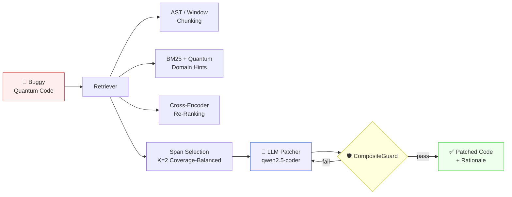

<div align="center">

# ⚛️ GRAP4Q

### *Guided Retrieval and Patching for Quantum Code*

**An LLM-based framework for safe, guardrail-constrained patching of quantum Python programs**

[](https://github.com/Al-Moccardi/GRAP4Q)
[](https://grapq.idealunina.com/)
[](https://www.python.org/)
[](https://qiskit.org/)
[](https://ollama.com/)
[](LICENSE)

---

*"Find the right span. Change as little as possible. Reject unsafe modifications."*

</div>

<br/>

## 🚀 The 30-second pitch

Quantum Python code is **brittle**: flipping two qubits in a CNOT, mixing a classical register where a quantum one is expected, or silently swapping `.get_data()` for `.get_counts()` can break a quantum algorithm without any visible syntax error. General-purpose code LLMs, trained mostly on classical Python, **systematically over-edit** these programs — fixing the surface bug while violating the deeper invariants.

**GRAP4Q is a retrieval-augmented, guardrail-constrained patching framework specifically engineered for this brittleness.** It combines:

🔍 &nbsp; A **quantum-aware retriever** that bounds *where* an LLM is allowed to edit
🛡️ &nbsp; A **runtime guardrail layer** that blocks edits violating quantum-program invariants
✏️ &nbsp; A **constrained LLM patcher** (qwen2.5-coder:14B) that produces minimal, auditable diffs with rationales

On the open-source **Bugs4Q** benchmark, GRAP4Q **never underperforms** an unguarded LLM baseline — and reduces the rate of unsafe patches by an order of magnitude.

<br/>

## 📊 Headline results

<div align="center">

| Metric | Pure-LLM | **GRAP4Q** | Δ |
|:---|:---:|:---:|:---:|
| Mean Lines-F1 (n=12) | 0.172 | **0.245** | +42% relative |
| Files patched | 8 / 12 | **12 / 12** | +50% coverage |
| Distortion rate | 67% | **8%** | −59 pp |
| Win / loss / tie | — | **5 / 0 / 7** | sign-test *p*=0.031 |

*Retrieval ceiling on the best configuration: Hit@K = MRR = nDCG@K = LineRecall@K = **1.00***

</div>

<br/>

## 🧠 How it works



The pipeline is governed by a **shared edit-region contract** between retrieval and guardrails: retrieval identifies the spans where edits are *syntactically* admissible, and the guardrails enforce *semantic* admissibility on whatever the LLM proposes within those spans.

<br/>

## 🛡️ The guardrail layer

GRAP4Q operates **two distinct safety layers**, often confused in the literature — we make the distinction explicit:

### Runtime guardrails *(applied during generation)*

Four deterministic checks that intercept unsafe LLM proposals **before** they leave the agent loop:

| # | Check | What it prevents |
|:---:|:---|:---|
| G1 | **EditRegionOK** | Edits outside the retrieval-selected spans |
| G2 | **PassInterfaceOK** | Silent changes to public function signatures |
| G3 | **QuantumRegisterSanityOK** | Quantum gates applied to classical registers |
| G4 | **QubitOrderHeuristicOK** | Uncontrolled qubit-index swaps in CNOT-like ops |

### Post-hoc admissibility *(applied during evaluation)*

Four retrospective criteria that quantify safety on a population of patches:

| # | Criterion | Pure-LLM | GRAP4Q |
|:---:|:---|:---:|:---:|
| 1 | AST parse failure | 5 / 12 | **0 / 12** |
| 2 | API drift > 40% | 1 / 12 | 1 / 12 |
| 3 | Identifier Jaccard < 0.60 | 1 / 12 | **0 / 12** |
| 4 | Excessive edits, no F1 gain | 1 / 12 | **0 / 12** |
| | **Any criterion fired** | **8 / 12** | **1 / 12** |

<br/>

## 🗂️ Repository layout

```
GRAP4Q/
├── 📄 paper/                   # Manuscript & supplementary material
│
├── 🧠 src/
│   ├── retrieval/              # Quantum-aware BM25 + cross-encoder
│   │   ├── chunker.py          # AST + sliding-window chunking
│   │   ├── ranker.py           # MS-MARCO MiniLM cross-encoder
│   │   └── selector.py         # Coverage-balanced K=2 selection
│   │
│   ├── patching/               # LLM patcher + guardrails
│   │   ├── agent.py            # Refinement loop with feedback
│   │   ├── guardrails.py       # CompositeGuard (G1–G4)
│   │   └── prompts.py          # System prompts (V1–V6 ablation)
│   │
│   └── evaluation/             # Lines-F1, drift, admissibility
│
├── 📊 experiments/             # Per-case CSVs, ablation logs
│   ├── combined_results_val.csv
│   ├── baselines_comparison_val.csv
│   └── prompt_ablation/
│
├── 🌐 webapp/                  # The deployed Flask UI
└── 📋 splits_70_25_5.json      # Deterministic train/val/test split
```

<br/>

## ⚡ Quickstart

```bash
# 1. Clone and install
git clone https://github.com/Al-Moccardi/GRAP4Q.git
cd GRAP4Q && pip install -r requirements.txt

# 2. Pull the LLM backbone (≈8 GB)
ollama pull qwen2.5-coder:14b-instruct

# 3. Patch a buggy quantum file
python run_grap4q.py --input examples/buggy_qft.py \
                     --output patched_qft.py \
                     --explain

# 4. Reproduce the validation results from the paper
python -m experiments.run_validation --split splits_70_25_5.json
```

> 💡 **Tip:** For an interactive exploration of the pipeline, visit the deployed web app at **[grapq.idealunina.com](https://grapq.idealunina.com/)** — it shows the buggy source, retrieval trace, guardrail verdict, and patched output side by side.

<br/>

## 🔬 What's in the paper

The accompanying manuscript reports:

- **A retrieval ablation** over chunking heads (AST vs sliding window), query hints, cross-encoder re-ranking, and selector strategies — identifying the configuration that achieves perfect retrieval on the validation cases.
- **A head-to-head GRAP4Q vs Pure-LLM evaluation** on 12 paired Bugs4Q cases, with paired statistical analysis (sign-test *p* = 0.031).
- **A non-learned APR baseline** (Rule-APR, 7 hand-coded migration rules) and a **quantum-oriented static analyser** (QChecker, 10 detection rules) for context.
- **A six-variant prompt-sensitivity ablation** (V1–V6) showing that runtime guardrails — not prompt-level reminders — carry the safety load.
- **An out-of-benchmark stress test** on five hand-crafted synthetic cases covering algorithmic sign errors, off-by-one logic, transpiler drift, and register misuse.

<br/>

## 📦 Reproducibility

| Artefact | Status |
|:---|:---:|
| Source code (retrieval + agent + guardrails) | ✅ |
| Deterministic data splits | ✅ |
| Per-case result CSVs | ✅ |
| Hardware spec & seed configuration | ✅ |
| Deployed web demo | ✅ |
| Ollama model versions pinned | ✅ |

**Hardware used:** Intel Ultra 9 185H · RTX 4070 · Ollama 0.11.10
**Backbone:** `qwen2.5-coder:14b-instruct` · `temperature = 0.0` · `seed = 7`

<br/>

## ⚠️ Honest limitations

We hold ourselves to the same scrutiny we apply to baselines:

- **Construct validity.** Lines-F1 measures line-overlap with the gold patch; it does not, by itself, certify functional correctness. The Bugs4Q benchmark lacks runnable test suites for most cases, so the `pytest` step degenerates to a compilation sanity check.
- **Statistical power.** The validation set is 12 cases; the effective differential sample is 5. Headline numbers are reported with this in mind.
- **Single backbone.** All results use one LLM (`qwen2.5-coder:14b-instruct`). The architecture is model-agnostic by construction, but cross-model generalisation is future work.
- **Component ablation.** Retrieval-only and guardrails-only conditions are not yet reported. The current evidence supports *"the coupled pipeline outperforms an unguarded baseline"*, not *"coupling is the cause"*.

<br/>

## 📚 Citation

If GRAP4Q informs your work, please cite the paper:

```bibtex
@article{amato2026grap4q,
  title   = {GRAP4Q: An LLM-based Framework for Quantum Coding Assistance},
  author  = {Amato, Flora and Cirillo, Egidia and
             Ghosh, Rajib Chandra and Moccardi, Alberto},
  journal = {Under review},
  year    = {2026},
  note    = {Code: \url{https://github.com/Al-Moccardi/GRAP4Q}}
}
```

<br/>

## 👥 Authors

<div align="center">

**Flora Amato** · **Egidia Cirillo** · **Rajib Chandra Ghosh** · **Alberto Moccardi**

*Department of Electrical Engineering and Information Technology (DIETI)*
*University of Naples Federico II — Italy* 🇮🇹

</div>

<br/>

## 🤝 Acknowledgements

This work was partially supported by **PNRR MUR Project PE0000013–FAIR**.

We thank the authors of the **Bugs4Q** benchmark for releasing the dataset that made this evaluation possible, and the **Qiskit**, **Ollama**, and **Sentence-Transformers** communities for the tooling.

<br/>

---

<div align="center">

**Built with ⚛️ in Naples · Open-source · Reproducible · Honest about its limits**

[🌐 Try it live](https://grapq.idealunina.com/) &nbsp;·&nbsp; [📖 Read the paper](https://github.com/Al-Moccardi/GRAP4Q) &nbsp;·&nbsp; [🐛 Report an issue](https://github.com/Al-Moccardi/GRAP4Q/issues)

</div>
