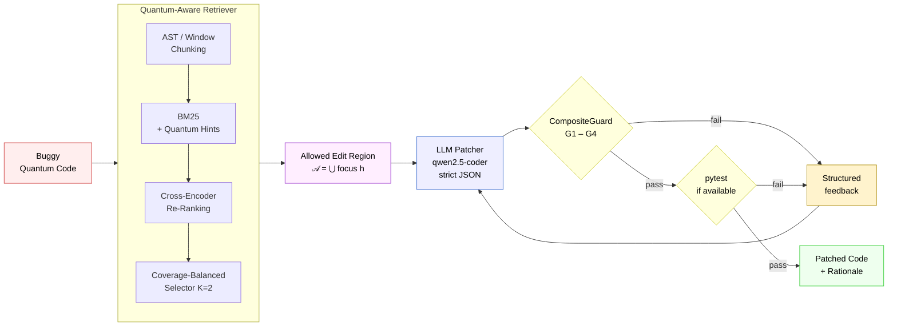

<div align="center">

# GRAP4Q

### Guided Retrieval and Patching for Quantum Code

**An LLM-based framework for guardrail-constrained patching of quantum Python programs**

[](https://github.com/Al-Moccardi/GRAP4Q)
[](https://grapq.idealunina.com/)
[](https://www.python.org/)
[](https://qiskit.org/)
[](https://ollama.com/)
[](LICENSE)

</div>

> **Note.** The `legacy/` and `new/` codebases are functionally identical; `new/` is a modularised, more readable refactoring of `legacy/` and produces the same experimental results.

> **Try the live demo:** [grapq.idealunina.com](https://grapq.idealunina.com/) — interactive Streamlit application demonstrating the full GRAP4Q pipeline.

<br/>

## Overview

This repository accompanies the manuscript *"GRAP4Q: An LLM-based Framework for Quantum Coding Assistance"* and provides the source code, data splits, experimental logs, and deployed demonstration of the framework described therein.

Quantum Python programs are sensitive to edits that preserve syntactic correctness but violate program-level invariants — for example, the ordering of qubits in two-qubit gates, the typing of quantum and classical registers, or the integrity of compiler-pass interfaces. General-purpose code language models, trained predominantly on classical Python, tend to over-edit such programs and break these invariants while addressing the surface defect.

GRAP4Q addresses this problem by coupling three components:

1. a **quantum-aware retriever** that selects the regions of the buggy file where edits are syntactically admissible;
2. a **runtime guardrail layer** that enforces four deterministic semantic checks on every candidate patch and triggers structured refinement feedback on failure;
3. a **constrained large-language-model patcher** that proposes minimal, span-bounded edits in a strict JSON schema, accompanied by a natural-language rationale.

The framework is evaluated on the open-source [Bugs4Q](https://zenodo.org/records/8148982) benchmark of reproducible quantum bugs, using `qwen2.5-coder:14b-instruct` as the generative backbone.

<br/>

## Empirical results

The principal finding on the validation partition (12 paired cases) is summarised below.

<div align="center">

| Metric | Pure-LLM | **GRAP4Q** | Δ |
|:---|:---:|:---:|:---:|
| Mean Lines-F1 | 0.172 | **0.245** | +0.073 (+42% relative) |
| Files patched | 8 / 12 | **12 / 12** | — |
| Output-side admissibility failures | 8 / 12 | **1 / 12** | −7 cases |
| Win / loss / tie | — | 5 / 0 / 7 | sign-test *p* = 0.031 |

</div>

The retrieval ablation (Section 6.1 of the manuscript) selects a configuration combining sliding-window chunking, quantum-domain query hints, cross-encoder re-ranking, and a coverage-balanced selector, which attains Hit@K = MRR = nDCG@K = LineRecall@K = 1.00 on the validation cases. Per-case data and reproduction scripts are provided under `experiments/`.

<br/>

## Architecture



The pipeline is governed by a shared edit-region contract between retrieval and the guardrail layer: the retriever computes the allowed region $\mathcal{A}$, the language model is constrained to propose edits whose intervals lie within $\mathcal{A}$, and the runtime checks G1–G4 enforce semantic admissibility on the resulting candidate. On failure, structured feedback is returned to the model for up to *T* = 2 refinement rounds before the system declares *No-Edit*.

<br/>

## Guardrail design

The framework operates two distinct safety layers, which the manuscript distinguishes carefully.

### Runtime guardrails (CompositeGuard)

Four deterministic checks applied during the agent loop (Algorithm 1):

| Check | Function |
|:---|:---|
| **G1 — EditRegionOK** | Verifies that every proposed edit interval lies within $\mathcal{A}$. |
| **G2 — PassInterfaceOK** | Verifies that public function signatures remain unchanged within edited ranges. |
| **G3 — QuantumRegisterSanityOK** | Forbids quantum gates on classical registers and vice versa. |
| **G4 — QubitOrderHeuristicOK** | Flags uncontrolled qubit-index swaps within edited spans. |

### Post-hoc admissibility criteria

Four retrospective measures used to evaluate patch safety on a population (Section 5.2.3):

| Criterion | Pure-LLM | GRAP4Q |
|:---|:---:|:---:|
| AST parse failure | 5 / 12 | **0 / 12** |
| API drift > 0.40 | 1 / 12 | 1 / 12 |
| Identifier Jaccard < 0.60 | 1 / 12 | **0 / 12** |
| Excessive edits, no F1 gain | 1 / 12 | **0 / 12** |
| **Any criterion fired** | **8 / 12** | **1 / 12** |

A six-variant prompt-sensitivity ablation (Section 8) further demonstrates that the runtime layer, rather than the prompt-level reminders, carries the safety load: removing the in-prompt quantum guardrail bullets (variant V6) leaves both Lines-F1 and admissibility unchanged.

<br/>

## Repository structure

```
GRAP4Q/
├── paper/                        Manuscript, figures, and supplementary material
│
├── legacy/                       Original monolithic implementation used for the paper
│   ├── experiments.ipynb         End-to-end notebook: retrieval, patching, evaluation
│   ├── prompts.py                System prompts for the V1–V6 ablation
│   └── utils/                    Helper functions (Ollama client, metrics, I/O)
│
├── new/                          Modularised refactoring of legacy/ — same outputs
│   ├── retrieval/
│   │   ├── chunker.py            AST and sliding-window chunking
│   │   ├── ranker.py             BM25 + cross-encoder (ms-marco-MiniLM-L-6-v2)
│   │   └── selector.py           Coverage-balanced K=2 span selection
│   │
│   ├── patching/
│   │   ├── agent.py              Refinement loop with structured feedback
│   │   ├── guardrails.py         CompositeGuard (G1–G4)
│   │   └── prompts.py            Prompt schema and V1–V6 variants
│   │
│   ├── evaluation/               Lines-F1, drift, identifier Jaccard, admissibility
│   └── run_grap4q.py             CLI entry point
│
├── webapp/                       Streamlit application (live demo source)
│   ├── app.py                    Three-panel inspection interface
│   └── assets/                   Static resources used by the UI
│
├── experiments/                  Reproducible experimental artefacts
│   ├── combined_results_val.csv          Per-case GRAP4Q vs Pure-LLM (n = 12)
│   ├── baselines_comparison_val.csv      Rule-APR and QChecker baselines
│   ├── prompt_ablation/                  Per-variant logs (V1–V6)
│   └── synthetic_stress/                 Out-of-benchmark cases (n = 5)
│
├── data/
│   └── bugs4q/                   Bugs4Q cases (buggy.py / fixed.py pairs)
│
├── splits_70_25_5.json           Deterministic train (70%) / val (25%) / test (5%) partition
├── requirements.txt              Python dependencies
├── LICENSE                       MIT License
└── README.md                     This document
```

The `legacy/` and `new/` directories are functionally identical and produce the same experimental results. `legacy/` is the original implementation used to compute the numbers reported in the manuscript; `new/` is a modular, more readable refactoring intended for extension and downstream use. Either may be used to reproduce the paper.

<br/>

## Reproduction

```bash
# Install dependencies
git clone https://github.com/Al-Moccardi/GRAP4Q.git
cd GRAP4Q && pip install -r requirements.txt

# Pull the language-model backbone (~8 GB)
ollama pull qwen2.5-coder:14b-instruct

# Patch a single buggy file (using the modular new/ implementation)
python new/run_grap4q.py --input examples/buggy_qft.py \
                         --output patched_qft.py \
                         --explain

# Reproduce validation-split results from the paper
python -m experiments.run_validation --split splits_70_25_5.json

# Launch the Streamlit demo locally
streamlit run webapp/app.py
```

A live demonstration of the pipeline, including a three-panel inspection view (buggy source, retrieval and guardrail trace, patched output with admissibility verdict), is available at [grapq.idealunina.com](https://grapq.idealunina.com/).

### Experimental configuration

| Parameter | Value |
|:---|:---|
| Generative backbone | `qwen2.5-coder:14b-instruct` (Ollama 0.11.10) |
| Decoding temperature | 0.0 |
| Random seed | 7 (Python, NumPy, `random`) |
| Refinement budget *T* | 2 |
| Selection budget *K* | 2 |
| Hardware (paper experiments) | Intel Ultra 9 185H, RTX 4070 |

<br/>

## Limitations

The manuscript discusses three principal threats to validity, which we record here in the interest of transparency.

- **Construct validity.** Lines-F1 measures line-overlap with the gold patch and does not, by itself, certify functional correctness. The Bugs4Q benchmark lacks runnable test suites for the majority of cases, so the `pytest` stage degenerates to a compilation sanity check. Patches that pass all checks may still contain semantic errors detectable only on real quantum hardware or advanced simulators.
- **Statistical power.** The validation partition contains 12 paired cases, of which seven are tied at zero F1 for both methods. The effective differential sample is therefore five.
- **Single-backbone evaluation.** All reported results use one language model. The framework is model-agnostic by construction, but cross-model generalisation has not yet been verified empirically.

A retrieval-only and guardrails-only ablation, isolating the contribution of each component independently, is left to future work.

<br/>

## Citation

```bibtex
@article{amato2026grap4q,
  title   = {GRAP4Q: An LLM-based Framework for Quantum Coding Assistance},
  author  = {Amato, Flora and Cirillo, Egidia and
             Ghosh, Rajib Chandra and Moccardi, Alberto},
  journal = {Under review},
  year    = {2026},
  note    = {Code: \url{https://github.com/Al-Moccardi/GRAP4Q}}
}
```

<br/>

## Authors

Flora Amato, Egidia Cirillo, Rajib Chandra Ghosh, Alberto Moccardi

Department of Electrical Engineering and Information Technology (DIETI),
University of Naples Federico II, Italy.

<br/>

## Acknowledgements

This work was partially supported by **PNRR MUR Project PE0000013 — FAIR**.

We thank the authors of the Bugs4Q benchmark for releasing the dataset on which this evaluation is based, and the maintainers of the Qiskit, Ollama, and Sentence-Transformers projects for the underlying tooling.

<br/>

## License

This repository is released under the MIT License. See [`LICENSE`](LICENSE) for details.
